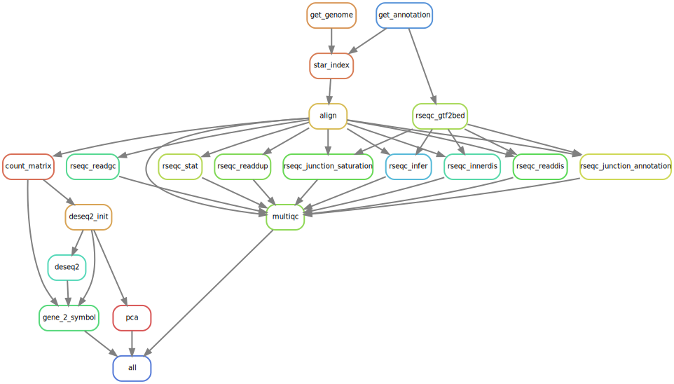

# (PART) GENE EXPRESSION {-}

# STAR Differentially Expressed Genes

<!--  -->
<center>

</center>

## Quick Data Exploration
```{r}
library(limma)
library(DESeq2)
library(dplyr)
library(readr)


countData = read_tsv("results/counts/all.tsv", skip = 0)
dim(countData)

columns = c('gene', 'A1', 'A2', 'B1', 'B2')
colnames(countData) = columns
par(mar=c(8,4,4,1)+0.1)
barplot( colSums(countData[, -1])/1e6, col="green",las=3,main="Total read counts (millions)", ylab="Total read counts in millions")

```

```{r}
logCountData = log2(1+countData[, -1])
par(mfrow = c(1, 2), mar=c(8,4,4,1))  # two columns
hist(logCountData[,1], main="Histogram of Log Read Counts", xlab="Log transformed counts")
boxplot(logCountData,las=3, main="Boxplot of Log Read Counts")
```
```{r}
x <- logCountData
myColors = rainbow(dim(x)[2])
plot(density(x[,1]),col = myColors[1], lwd=2,
     xlab="Expresson values", ylab="Density", main= "Distribution of transformed data",
     ylim=c(0, max(density(x[,1])$y)+.02 ) )
  
for( i in 2:dim(x)[2] )
lines(density(x[,i]),col=myColors[i], lwd=2)
legend("topright", cex=1.1,colnames(x), lty=rep(1,dim(x)[2]), col=myColors )	
```
```{r}
plot(logCountData[,1],logCountData[,2], xlab="A1", ylab="A2")
```

## Creating a DESeq Dataset
```{r}
# dds = DESeqDataSetFromMatrix(countData=countData,
#                              colData=colData,
#                              design= ~ p53+treatment+p53*treatment)
# dds = DESeq(dds)  # main function

dds <- readRDS("results/deseq2/all.rds")
dds
```

## Filtering genes with low counts
- Keep genes that have a sum count between all samples greater than 5

```{r}
detectGroups <- function (x){  # x are col names
  tem <- gsub("[0-9]*$","",x) # Remove all numbers from end
  #tem = gsub("_Rep|_rep|_REP","",tem)
  tem <- gsub("_$","",tem); # remove "_" from end
  tem <- gsub("_Rep$","",tem); # remove "_Rep" from end
  tem <- gsub("_rep$","",tem); # remove "_rep" from end
  tem <- gsub("_REP$","",tem)  # remove "_REP" from end
  return( tem )
}

groups = as.character ( detectGroups( colnames( countData ) ) )
groups
```
```{r}
condn = c("trt","m", "m", "p", "p")
treatment = c("condition", "condition", "sizeFactor", "sizeFactor")
```

```{r}
colData = cbind(colnames(countData), condn )
colData
```


```{r}
dds <- dds[ rowSums(counts(dds)) > 2, ]
dds
```

## Regularized log transformation
- Important for clustering

```{r}
library(kableExtra)
rld <- rlog(dds, blind = FALSE)
kable(head(assay(vsd), 6)) %>%
  kable_styling() %>%
  scroll_box(width = "1000px", height = "300px")
```

## Variance stablizing transformation
```{r}
vsd <- varianceStabilizingTransformation(dds, blind = FALSE)
kable(head(assay(vsd), 6)) %>%
  kable_styling() %>%
  scroll_box(width = "500px", height = "300px")
```

## Size factor
```{r}
dds <- estimateSizeFactors(dds)
kable(sizeFactors(dds)) %>%
  kable_styling() %>%
  scroll_box(width = "200px", height = "520px")
```


## Log transformaed data
```{r}
slog <- log2(counts(dds, normalized=TRUE)+1)
kable(head(slog)) %>%
  kable_styling() %>%
  scroll_box(width = "=400px", height = "300px")
```

```{r}
par(mfrow = c(1, 3))  # 3 columns
plot(slog[,1],slog[,2])
plot(assay(rld)[,1],assay(rld)[,2])
plot(assay(vsd)[,1],assay(vsd)[,2])
```
```{r}
par(mfrow = c(1, 3))  # 3 columns
slog <- log2(counts(dds, normalized=TRUE)+1)
plot(slog[,1],slog[,2])
slog <- log2(counts(dds, normalized=TRUE)+4)
plot(slog[,1],slog[,2], xlim=c(0,20))
slog <- log2(counts(dds, normalized=TRUE)+20)
plot(slog[,1],slog[,2], xlim=c(0,20))
```

```{r}
library("dplyr")
library("ggplot2")

df <- bind_rows(
  as_tibble(slog[,1:2]) %>%
         mutate(transformation = "log2(x + 1)"),
  as_tibble(assay(rld)[, 1:2]) %>% mutate(transformation = "rlog"),
  as_tibble(assay(vsd)[, 1:2]) %>% mutate(transformation = "vst"))

```

```{r}
colnames(df)[1:2] <- c("x", "y")  

ggplot(df, aes(x = x, y = y)) + geom_hex(bins = 80) +
  coord_fixed() + facet_grid( . ~ transformation)
```

## PCA plot with R base
```{r}
plotPCA(rld, intgroup = c("condition", "sizeFactor")) + theme(aspect.ratio=1)
```

## PCA plot created with GGPlot2

```{r}
pca.object <- prcomp(t(assay(rld))) # PCA 
pcaData = as.data.frame(pca.object$x[,1:2]); 
pcaData = cbind(pcaData,detectGroups(colnames(assay(rld)) ))
colnames(pcaData) = c("PC1", "PC2", "Type")
percentVar=round(100*summary(pca.object)$importance[2,1:2],0)
#plot
p=ggplot(pcaData, aes(PC1, PC2, color=Type, shape = Type)) + geom_point(size=3) 
p=p+xlab(paste0("PC1: ",percentVar[1],"% variance")) 
p=p+ylab(paste0("PC2: ",percentVar[2],"% variance")) 
p=p+ggtitle("Principal component analysis (PCA)")+coord_fixed(ratio=1.0)+ 
    theme(plot.title = element_text(size = 12,hjust = 0.5)) + theme(aspect.ratio=1) +
    theme(axis.text.x = element_text( size = 12),
    axis.text.y = element_text( size = 12),
    axis.title.x = element_text( size = 12),
    axis.title.y = element_text( size = 12) ) +
  theme(legend.text=element_text(size=12))
print(p)
```

## Multidimensional Scaling Plot
```{r}
dist2 <- function(x, ...)   # distance function = 1-PCC (Pearson's correlation coefficient)
  as.dist(1-cor(t(x), method="pearson"))

fit = cmdscale( dist2(t(assay(rld))) , eig=T, k=2)
mdsData <- as.data.frame(fit$points[,1:2]); 
mdsData <- cbind(mdsData,detectGroups(colnames(assay(rld))) )
colnames(mdsData) = c("x1", "x2", "Type")
	
p<-ggplot(mdsData, aes(x1, x2, color=Type, shape = Type)) + geom_point(size=3) 
p=p+xlab("Dimension 1") 
p=p+ylab("Dimension 2") 
p=p+ggtitle("Multidimensional scaling (MDS)")+ coord_fixed(ratio=1.)+ 
     theme(plot.title = element_text(hjust = 0.5)) + theme(aspect.ratio=1) +
	 	 theme(axis.text.x = element_text( size = 12),
        axis.text.y = element_text( size = 12),
        axis.title.x = element_text( size = 12),
        axis.title.y = element_text( size = 12) ) +
	   theme(legend.text=element_text(size=12))
print(p)
```

## Creating a heatmap
```{r}
library(gplots)

hclust2 <- function(x, method="average", ...)  # average linkage in hierarchical clustering
  hclust(x, method=method, ...)

n=100 # number of top genes by standard deviation

x = assay(rld)
if(n>dim(x)[1]) n = dim(x)[1] # max	as data

x = x[order(apply(x,1,sd),decreasing=TRUE),]  # sort genes by standard deviation

x = x[1:n,]   # only keep the n genes

# this will cutoff very large values, which could skew the color 
x=as.matrix(x[1:n,])-apply(x[1:n,],1,mean)
cutoff = median(unlist(x)) + 4*sd (unlist(x)) 
x[x>cutoff] <- cutoff
cutoff = median(unlist(x)) - 4*sd (unlist(x)) 
x[x< cutoff] <- cutoff
	
groups = detectGroups(colnames(x) )
groups.colors = rainbow(length(unique(groups) ) )


	lmat = rbind(c(5,4),c(0,1),c(3,2))
	lwid = c(1.5,4)
	lhei = c(1,.2,4)


heatmap.2(x, distfun = dist2,hclustfun=hclust2,
	 col=greenred(75), density.info="none", trace="none", scale="none", keysize=.5
	,key=T, symkey=F
	,ColSideColors=groups.colors[ as.factor(groups)]
	,margins=c(8,12)
	,cexRow=1
	,srtCol=45
	,cexCol=1.  # size of font for sample names
	,lmat = lmat, lwid = lwid, lhei = lhei
	)
```
## Differentially Expressed Genes
```{r}
dds <- DESeq(dds)
res <- results(dds)

kable(head(res)) %>%
  kable_styling() #%>%
  # scroll_box(width =  "500px", height = "300px")
```

## Using Benjamini-Hochberg (BH) adjustment 
```{r}
res <- results(dds, alpha = 0.5, lfcThreshold=0.01)
summary(res)
```

## Sorting by fold change
```{r}
res <- res[order(abs( res$log2FoldChange), decreasing=TRUE),]
kable(head(res)) %>%
  kable_styling() %>%
  scroll_box(width = "1000px", height = "300px")
```

## Result Visualization

## MA Plot
- Shows the significant genes. 
- The lower the average read counts for all samples and the higher the variation between the samples, the less significant those genes are.

```{r}
DESeq2::plotMA(res,  ylim = c(-5, 5))
```

### Volcano plot
```{r}
library(dplyr)
res1 = as.data.frame(res)
# add a new column using the mutate function in dplyr
res1 = mutate(res1, sig=ifelse(res1$padj<0.1, "FDR<0.05", "Not Sig"))
res1[which(abs(res1$log2FoldChange)<0.5),'sig'] <- "Not Sig"


p = ggplot(res1, aes(log2FoldChange, -log10(padj))) +
  geom_point(aes(col=sig)) +
  scale_color_manual(values=c("red", "black"))
p
```
## Gene Annotations
## Plotting counts of top gene
```{r}
topGene <- rownames(res)[1]
plotCounts(dds, gene = topGene)

```
```{r}
library(AnnotationDbi)
library(yeast.db0)
yeast.db0
```


```{r}
Go3tablenames <- function(all=FALSE)
{
    tablenames <- c("go_bp", "go_cc", "go_mf")
    if (all)
        tablenames <- paste0(tablenames, "_all")
    names(tablenames) <- c("BP", "CC", "MF")
    tablenames
}

YEASTNCBI_DB_L2Rlink1 <- list(tablename="genes", Lcolname="gene_id", Rcolname="_id")

### Mandatory fields: objName, Class and L2Rchain
YEASTNCBI_DB_AnnDbBimap_seeds <- list(
    list(
        objName="ACCNUM",
        Class="AnnDbBimap",
        L2Rchain=list(
            YEASTNCBI_DB_L2Rlink1,
            list(
                tablename="accessions",
                Lcolname="_id",
                Rcolname="accession"
            )
        )
    ),
    list(
        objName="ALIAS2EG",
        Class="AnnDbBimap",
        L2Rchain=list(
            YEASTNCBI_DB_L2Rlink1,
            list(
                tablename="alias",
                Lcolname="_id",
                Rcolname="alias_symbol"
            )
        ),
        direction=-1L
    ),
    list(
        objName="CHR",
        Class="AnnDbBimap",
        L2Rchain=list(
            YEASTNCBI_DB_L2Rlink1,
            list(
                tablename="chromosomes",
                Lcolname="_id",
                Rcolname="chromosome"
            )
        )
    ),
    list(
        objName="ENZYME",
        Class="AnnDbBimap",
        L2Rchain=list(
            YEASTNCBI_DB_L2Rlink1,
            list(
                tablename="ec",
                Lcolname="_id",
                Rcolname="ec_number"
            )
        )
    ),
    list(
        objName="GENENAME",
        Class="AnnDbBimap",
        L2Rchain=list(
            YEASTNCBI_DB_L2Rlink1,
            list(
                tablename="gene_info",
                Lcolname="_id",
                Rcolname="gene_name"
            )
        )
    ),
    list(
        objName="PATH",
        Class="AnnDbBimap",
        L2Rchain=list(
            YEASTNCBI_DB_L2Rlink1,
            list(
                tablename="kegg",
                Lcolname="_id",
                Rcolname="path_id"
            )
        )
    ),
    list(
        objName="PMID",
        Class="AnnDbBimap",
        L2Rchain=list(
            YEASTNCBI_DB_L2Rlink1,
            list(
                tablename="pubmed",
                Lcolname="_id",
                Rcolname="pubmed_id"
            )
        )
    ),
    list(
        objName="REFSEQ",
        Class="AnnDbBimap",
        L2Rchain=list(
            YEASTNCBI_DB_L2Rlink1,
            list(
                tablename="refseq",
                Lcolname="_id",
                Rcolname="accession"
            )
        )
    ),
    list(
        objName="SYMBOL",
        Class="AnnDbBimap",
        L2Rchain=list(
            YEASTNCBI_DB_L2Rlink1,
            list(
                tablename="gene_info",
                Lcolname="_id",
                Rcolname="symbol"
            )
        )
    ),
    list(
        objName="ENSEMBL",
        Class="AnnDbBimap",
        L2Rchain=list(
            YEASTNCBI_DB_L2Rlink1,
            list(
                tablename="ensembl",
                Lcolname="_id",
                Rcolname="ensembl_id"
            )
        )
    ),
    list(
        objName="ENSEMBLPROT",
        Class="AnnDbBimap",
        L2Rchain=list(
            YEASTNCBI_DB_L2Rlink1,
            list(
                tablename="ensembl_prot",
                Lcolname="_id",
                Rcolname="prot_id"
            )
        )
    ),
    list(
        objName="ENSEMBLTRANS",
        Class="AnnDbBimap",
        L2Rchain=list(
            YEASTNCBI_DB_L2Rlink1,
            list(
                tablename="ensembl_trans",
                Lcolname="_id",
                Rcolname="trans_id"
            )
        )
    ),
    list(
        objName="UNIPROT",
        Class="AnnDbBimap",
        L2Rchain=list(
            YEASTNCBI_DB_L2Rlink1,
            list(
                tablename="uniprot",
                Lcolname="_id",
                Rcolname="uniprot_id"
            )
        )
    ),
    list(
        objName="SGD",
        Class="AnnDbBimap",
        L2Rchain=list(
            YEASTNCBI_DB_L2Rlink1,
            list(
                tablename="sgd",
                Lcolname="_id",
                Rcolname="sgd_id"
            )
        )
    ),
    list(
        objName="ORF",
        Class="AnnDbBimap",
        L2Rchain=list(
            YEASTNCBI_DB_L2Rlink1,
            list(
                tablename="locus_tag",
                Lcolname="_id",
                Rcolname="locus_tag"
            )
        )
    ),
    list(
        objName="GO",
        Class="Go3AnnDbBimap",
        L2Rchain=list(
            YEASTNCBI_DB_L2Rlink1,
            list(
                #tablename="go_term", # no rightmost table for a Go3AnnDbBimap
                Lcolname="_id",
                tagname=c(Evidence="{evidence}"),
                Rcolname="go_id",
                Rattribnames=c(Ontology="NULL")
            )
        ),
        rightTables=Go3tablenames()
    )
)

createAnnObjs.YEASTNCBI_DB <- function(prefix, objTarget, dbconn, datacache)
{
    checkDBSCHEMA(dbconn, "YEASTNCBI_DB")

    ## AnnDbBimap objects
    seed0 <- list(
        objTarget=objTarget,
        datacache=datacache
    )
    ann_objs <- createAnnDbBimaps(YEASTNCBI_DB_AnnDbBimap_seeds, seed0)

    ## Reverse maps
    ann_objs$ACCNUM2EG <- revmap(ann_objs$ACCNUM, objName="ACCNUM2EG")
    ann_objs$ENZYME2EG <- revmap(ann_objs$ENZYME, objName="ENZYME2EG")
##     ann_objs$MAP2EG <- revmap(ann_objs$MAP, objName="MAP2EG")
    ann_objs$PATH2EG <- revmap(ann_objs$PATH, objName="PATH2EG")
    ann_objs$PMID2EG <- revmap(ann_objs$PMID, objName="PMID2EG")
    ann_objs$REFSEQ2EG <- revmap(ann_objs$REFSEQ, objName="REFSEQ2EG")
    ann_objs$SYMBOL2EG <- revmap(ann_objs$SYMBOL, objName="SYMBOL2EG")
    ann_objs$ORF2EG <- revmap(ann_objs$ORF, objName="ORF2EG")
    ann_objs$SGD2EG <- revmap(ann_objs$SGD, objName="SGD2EG")    
##     ann_objs$ENSEMBL2EG <- revmap(ann_objs$ENSEMBL, objName="ENSEMBL2EG")
##     ann_objs$ENSEMBLPROT2EG <- revmap(ann_objs$ENSEMBLPROT, objName="ENSEMBLPROT2EG")
##     ann_objs$ENSEMBLTRANS2EG <- revmap(ann_objs$ENSEMBLTRANS, objName="ENSEMBLTRANS2EG")
    ann_objs$GO2EG <- revmap(ann_objs$GO, objName="GO2EG")
    map <- ann_objs$GO2EG
    map@rightTables <- Go3tablenames(all=TRUE)
    map@objName <- "GO2ALLEGS"
    ann_objs$GO2ALLEGS <- map

    ## 2 special maps that are not AnnDbBimap objects (just named integer vectors)
    ann_objs$CHRLENGTHS <- createCHRLENGTHS(dbconn)
    ann_objs$MAPCOUNTS <- createMAPCOUNTS(dbconn, prefix)

    ## Some pre-caching
    Lkeys(ann_objs$GO)
    #mappedLkeys(ann_objs$GO)
    #Rkeys(ann_objs$GO2EG)
    #mappedRkeys(ann_objs$GO2EG)

    prefixAnnObjNames(ann_objs, prefix)
}

```


```{r}
```


```{r}
resSig = as.data.frame(subset(res, padj<0.5))
resSig = resSig[order(resSig$log2FoldChange,decreasing=TRUE),]
head(resSig)

write_csv(resSig,"SigGenes.csv")
```

```{r}
library(dplyr)
res$symbol <- rownames(res)
res1 = as.data.frame(res)
# add a new column using the mutate function in dplyr
res1 = mutate(res1, sig=ifelse(res1$padj<0.5, "FDR<0.05", "Not Sig"))
res1[which(abs(res1$log2FoldChange)<1),'sig'] <- "Not Sig"
p = ggplot(res1, aes(log2FoldChange, -log10(pvalue))) +
  geom_point(aes(col=sig)) +
  scale_color_manual(values=c("red", "black"))
p+geom_text(data=filter(res1, padj<1e-50), aes(label=symbol))

```

## GO Enrichment analysis using GOstats
- Annotating genes that have a decreased fold-change of 5 or more

```{r eval=FALSE, include=FALSE}
library(GO.db)
library(GOstats)
selectedGenes = unique(resSig[resSig$log2FoldChange>5,'entrez'])  # upregulated genes
universeGenes =  unique( mapIds(org.Mm.eg.db,
                     keys= res$ensembl,
                     column="ENTREZID",
                     keytype="ENSEMBL", #Out ID is ENSMBL
                     multiVals="first")
                    )


 hgCutoff <- 0.001
 params <- new("GOHyperGParams",
     geneIds=selectedGenes,
     universeGeneIds=universeGenes,
     annotation="org.Mm.eg.db",
     ontology="BP",
     pvalueCutoff=hgCutoff,
     conditional=FALSE,
     testDirection="over")

hgOver <- hyperGTest(params)
summary(hgOver)[1:10,]

summary(hgOver)[1:10,c("GOBPID","Pvalue","Term")]

params1 <- params
ontology(params1) <- "CC"
hgOver <- hyperGTest(params1)
summary(hgOver)[1:10,c("GOCCID","Pvalue","Term")]

params1 <- params
ontology(params1) <- "MF"
hgOver <- hyperGTest(params1)
summary(hgOver)[1:10,c("GOMFID","Pvalue","Term")]

```

## GO Enrichment analysis of downregulated genes
```{r eval=FALSE, include=FALSE}
selectedGenes = unique(resSig[resSig$log2FoldChange<5,'entrez'])  # upregulated genes

 params <- new("GOHyperGParams",
     geneIds=selectedGenes,
     universeGeneIds=universeGenes,
     annotation="org.Mm.eg.db",
     ontology="BP",
     pvalueCutoff=hgCutoff,
     conditional=FALSE,
     testDirection="over")

hgOver <- hyperGTest(params)
summary(hgOver)[1:10,c("GOBPID","Pvalue","Term")]
```

## Pathway analysis using expression data
```{r}
library(pathviewr) 
library(gage) 
```

## Prepare data
```{r}
foldchanges = res$log2FoldChange
names(foldchanges) = res$entrez
head(foldchanges)
```

```{r}
library(gageData)
data(go.sets.mm)
data(go.subs.mm)
gobpsets = go.sets.mm[go.subs.mm$BP]
gobpres = gage(foldchanges, gsets=gobpsets, same.dir=TRUE)
#lapply(gobpres, head)
message("Greater")
```

```{r}
kable(head(gobpres$greater)) %>%
  kable_styling() %>%
  scroll_box(width = "1000px", height = "300px")
```

```{r}
kable(head(gobpres$less)) %>%
  kable_styling() %>%
  scroll_box(width = "1000px", height = "300px")
```

## KEGG pathways
```{r}
library(gageData)
data(kegg.sets.mm)
data(sigmet.idx.mm)
kegg.sets.mm = kegg.sets.mm[sigmet.idx.mm]
#head(kegg.sets.mm, 3)

message("Greater")
```

```{r}
kable(head(kegg.sets.mm$less)) %>%
  kable_styling() %>%
  scroll_box(width = "1000px", height = "300px")
```

```{r}
kable(head(kegg.sets.mm$stats)) %>%
  kable_styling() %>%
  scroll_box(width = "1000px", height = "300px")
```

## Get the results
```{r}
keggres = gage(foldchanges, gsets=kegg.sets.mm, same.dir=TRUE)

# Look at both up (greater), down (less), and statatistics.
#lapply(keggres, head, n=10)
message("Greater")
```

```{r}
kable(head(keggres$greater)) %>%
  kable_styling() %>%
  scroll_box(width = "1000px", height = "300px")
```
```{r}
keggrespathways = data.frame(id=rownames(keggres$less), keggres$less) %>% 
  tbl_df() %>% 
  filter(row_number()<=5) %>% 
  .$id %>% 
  as.character()
keggrespathways
```

## Get the IDs
```{r}

keggresids = substr(keggrespathways, start=1, stop=8)
keggresids
```

```{r}
# Define plotting function for applying later
plot_pathway = function(pid) pathview(gene.data=foldchanges, pathway.id=pid, species="mmu", new.signature=FALSE)

# plot multiple pathways (plots saved to disk and returns a throwaway list object)
tmp = sapply(keggresids, function(pid) pathview(gene.data=foldchanges, pathway.id=pid, species="mmu"))
```


