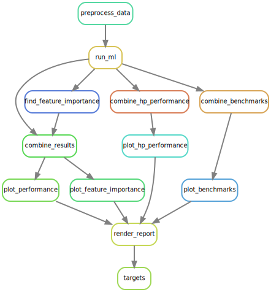

<br><br>

<link rel="preconnect" href="https://fonts.googleapis.com">
<link rel="preconnect" href="https://fonts.gstatic.com" crossorigin>
<link href="https://fonts.googleapis.com/css2?family=Montserrat&display=swap" rel="stylesheet">


```{r echo = FALSE, message = FALSE}
library(tidyverse)
library(lubridate)
```

```{css echo = FALSE}
.author {
  display: none;
} 
.main-container {
  max-width: 80%;
  background-color: black;
  color: white;
  padding: 3% 3% 3% 3%;
  margin-left: auto;
  margin-right: auto;
}
body{
  font-size: 14px;
  text-align: left;
}
@media only screen and (max-width: 768px) {
  .main-container {
  max-width: 100%;
  background-color: black;
  color: white;
  padding: 1% 1% 1% 1%;
  margin-left: auto;
  margin-right: auto;

  }
   body {
    font-size: 12px;
    width: 100%;
  }
  #header h1{
    font-size: 2.2em;  
  }
  #glimpse h1{
    font-size: 3.0em;
  } 
  #glimpse p{
    font-size: 1.5em;
  } 
  #footer {
    text-align: left;
    font-size: 1.1em;
  } 
  #header h3{
    font-size: 1.8em;
  }
  #header img{
  max-width:80%;
  }
  #tablefield {
  width: 100%;
  margin-left: auto;
  margin-right: auto;
} 
body h1{
  font-size: 1.8em;
  text-transform: capitalize;
}
body h2{
  font-size: 1.6em;
}

body h3{
  font-size: 1.6em;
}

#tablefield h2{
  font-size: 1.6em;
}
}

#header {
  background-color: #013011;
  color: #f5f5f5;
  font-family: "Montserrat", sans-serif;
  text-align: center;
  width: 100%;
  padding: 5% 0% 0% 0%;
  text-transform: none;
}
#header h3, #glimpse h1{
  color: #b5f56b;
}

#header h1{
  font-size: 3.5em;
}

#header h3{
  font-size: 2.0em;
}
#header img{
width:70%;
}

body {
  background-color: F5F5F5;
  color: white;
  font-family: "Montserrat", sans-serif;
}
body h1{
  font-size: 2.5em;
  text-transform: capitalize;
}
body h2{
  font-size: 2.0em;
}

body h3{
  font-size: 1.6em;
}

table tbody tr td {
  font-size: 14px;
  text-transform: capitalize;
}
body img{
  width: 100%;
  display: block;
  margin-left: auto;
  margin-right: auto;
  padding: 20px, 50px, 20px, 50px;
}
#glimpse{
  text-align: center;
}

#glimpse h1{
  text-transform: none;
}

a{
  color: #6bb7f5;
}
#tablefield {
  max-width: 80%;
  margin-left: auto;
  margin-right: auto;
}   
```

<div id="glimpse">
# Highly Reviewed and Tested Templates

These templates cover the main analytics steps and allow continuous improvement and integration.

<hr>
</div>

<div id="tablefield">

## Multi-Omics Data Insights

|Type of Analysis| Skills and Tools |
|:-------------------------|:--------------------:
| Gene expression analysis | RNA-seq, STAR, DESeq, Snakemake, R, Python <br>[Workflow](https://tmbuza.github.io/bs4book-ci-cd/#gene-expression-analysis) | 
| Gene enrichment analysis | RNA-seq, STAR, DESeq, Snakemake, R, Python <br>[Workflow](https://tmbuza.github.io/bs4book-ci-cd/#gene-enrichment-analysis) | 
| Variant calling analysis| BWA, Snakemake,  <br>[Workflow](https://tmbuza.github.io/bs4book-ci-cd/#variant-calling) |
| Genome wide association study | kGWASflow,  <br>[Workflow](https://tmbuza.github.io/bs4book-ci-cd/#genome-wide-association-study) |
| Single Cell Analysis | scRNASeq, Scanpy, Python, Jupyter Notebook <br>[Workflow](https://tmbuza.github.io/bs4book-ci-cd/#single-cell-analysis) |
| Amplicon data analysis (16S)| Mothur, QIIME2, R, Python <br>[Workflow: In progress]() |
| Metagenomics data analysis <br> Microbial and pathway profiling|Biobakery, R, Python <br>[Workflow: In progress]() |
| Microbiome Machine learning models| MikropML, Caret, Snakemake, R, Python  <br>[Workflow](https://tmbuza.github.io/bs4book-ci-cd/#microbiome-machine-learning-models) |
| Gene Ontology Enrichment| GO, Proteomics, Snakemake, R, Python  <br>[Workflow](https://tmbuza.github.io/bs4book-ci-cd/#gene-ontology-enrichment) |

<br><br><br>

## Machine learning models

|Model| Tools |
|:-------------------------|:--------------------:
| Logistic Regression|MikropML, Caret, Snakemake, R, Python <br>[Workflow: In progress]() |
| Rainfall forest|  Snakemake, R, Python <br>[Workflow: In progress]() |
| Support vector machine|  Snakemake, R, Python <br>[Workflow: In progress]() |

<br><br><br>

## Quantitative Data Analysis

|Analysis| Tools |
|:-------------------------|:--------------------:
| Precipitation & drought| Snakemake, R, Python <br>[Workflow: In progress]() |
| Temperature anomalies| Snakemake, R, Python <br>[Workflow: In progress]() |
| Time Series Analysis|  R, Python <br>[Workflow: In progress]() |

# Goal: Sustainable Data Analysis
- Reproducibility
- Adaptability
- Transparency

Reference: https://f1000research.com/articles/10-33

<!--  -->

Aspects to consider for sustainable data analysis.


</div> <!-- end of tablefield -->


# Example of Snakemake workflow syntax
## A
<!--  -->


## B


<br><br><hr>

# Differentially Expressed Genes
<!--  -->


<!--  -->


<br><br><br>

# Gene Set GO-Based Enrichment
<!--  -->


<br><br><br>

# Gene user-Set Enrichment
<!--  -->


<br><br><br>

# Variant calling
<!--  -->


<br><br>

- [Lumpy vcf dataset](https://raw.githubusercontent.com/VCCRI/SVPV/master/example/lumpy.vcf)
- [Delly vcf dataset](https://raw.githubusercontent.com/VCCRI/SVPV/master/example/delly.vcf)


- [Delly vcf dataset](https://raw.githubusercontent.com/VCCRI/SVPV/master/example/delly.vcf)


<br><br>

- Using small test dataset


<br><br><br>

# Genome wide association study
<!--  -->


<br><br><br>

# Gene Ontology Enrichment

<!--  -->


<br><br><br>

# Single Cell Analysis

<!--  -->


<br><br><br>

# Number of genes

<!--  -->


# Highly variable genes

<!--  -->


# Principal Component analysis

<!--  -->


# Biomarker Discovery

<!--  -->


<br><br><br>

# Microbial profiling

<!--  -->


<br><br><br>

# Machine learning models
<!--  -->


<br><br><br>

# Quantitative data analysis
<!--  -->


Daily global drought index (Standardized z-scores for ~50years).

<br><br>

<br><br>


Temperature anomalies from 1880 (inner layer) to present (2022, outer layer).


# Helpfull Ideas


<br><br><hr>

<div id="footer">
Last updated on `r Sys.time()`  
Workflows compiled by [TMBuza](mailto:`r rmarkdown::metadata$email_address`).   
For more details, visit the [CDI website](`r rmarkdown::metadata$website`) (...in progress).
</div>
