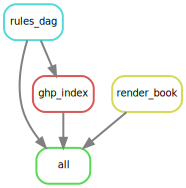
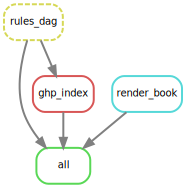

<link rel="preconnect" href="https://fonts.googleapis.com">
<link rel="preconnect" href="https://fonts.gstatic.com" crossorigin>
<link href="https://fonts.googleapis.com/css2?family=Montserrat:ital@1&display=swap" rel="stylesheet">

```{r echo = FALSE, message = FALSE}
library(lubridate)
```

<!-- <style>
@import url('https://fonts.googleapis.com/css2?family=Montserrat:ital@1&display=swap');
</style> -->
<!-- Usage: font-family: 'Montserrat', sans-serif; -->

```{css echo = FALSE}
.author, .title {
  display: none;
}
.main-container {
  max-width: 100%;
}
body {
  background-color: black;
  color: #f5f5f5;
  font-size: 1.0vw;
  font-family: "Montserrat", sans-serif;
}
body {
  background-color: rgb(2, 14, 20);
  color: #f5f5f5;
  font-size: 1.0vw;
  font-family: "Montserrat", sans-serif;
}
```


# Testing {#ghp-index}

{width=50%}


## Rulegraph in SVG format


<br>
<br>

## DAG  workflow in PNG format


<br>


Last updated on `r Sys.time()`  
This code was modified by [TMB](mailto:`r rmarkdown::metadata$email_address`), it is available [here](`r rmarkdown::metadata$github_repo`).  
Reference: See Reference chapter  
